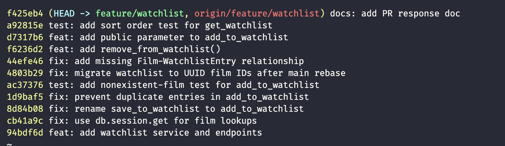

# PR Response Doc — CineLog Watchlist Feature
## AI Usage
I used AI tools (Claude) throughout this project for orientation and hygiene, but not to make the Comment 4/5 design decisions themselves.

- **File/function summary before reading the review comments:** Before touching any code, I had the AI read `models.py` and `services/collection_service.py` in full and summarize what each was responsible for and what functions like `add_to_collection()` return, including its `FilmNotFoundError`/`AlreadyInCollectionError` behavior. This is what made Comment 2 ("handle the duplicate case") immediately legible — I already knew the exact pattern (`.filter_by(...).first()` check before insert) to mirror, rather than inventing my own approach.
- **Test structure orientation:** Had the AI walk through `tests/test_collection.py`'s fixture structure (`app`/`sample_user`/`sample_film`, in-memory SQLite, `db.create_all()`/`drop_all()` per test) before writing `tests/test_watchlist.py`, so the new file matches the existing style rather than introducing a second testing convention.
- **Devil's-advocate pass on Comments 4 and 5:** After drafting my own positions (keep `public=True`, push back on date-added sort), I asked what counterargument a careful reviewer would raise against each. For Comment 4, the pushback was that "public by default" is a stronger default than it sounds like since there's no friend/follow graph gating who can see it — I hadn't fully weighed that "public" here means *world-readable*, not *visible to connections*, and folded that directly into the Tradeoff section rather than glossing over it. For Comment 5, the pushback was that I had no actual usage data to back up "watchlists get revisited over time, not just browsed for recent adds" — I kept my position (alphabetical, matching the `list_films()` precedent already in the codebase) but added the explicit concession that I don't have usage data and proposed a fallback (`?sort=recent` param) if that assumption turns out wrong. Both final write-ups are mine — grounded in this repo's actual model relationships (no follow graph) and actual code precedent (`routes/films.py`'s title sort) — not the generic version the AI initially offered.
- **Commit format check:** Before finalizing, I ran `git log --oneline` past the AI and asked whether the messages followed Conventional Commits and whether any bundled multiple logical changes. It flagged that the two "stretch feature" commits (`remove_from_watchlist()`, `public` parameter) each bundle their own tests into the same commit as the feature code, and asked whether those should split out. I considered this and disagreed with splitting: a `feat:` commit introducing a new function together with the test that proves it works is one coherent unit of work, not two — CONTRIBUTING.md's "bug fix + test are two commits" example is about adding a regression test to *pre-existing* code, which isn't the situation here. I verified the final 10-commit history myself against the Conventional Commits spec before taking the screenshot below.

## Comment 1 — Rename
**What I did:** Renamed `save_to_watchlist()` to `add_to_watchlist()` in `services/watchlist_service.py` to match the project's `verb_to_noun` convention (`add_to_collection()`, `remove_from_collection()`).

**How I verified:** Ran `grep -rn "save_to_watchlist" --include="*.py" .` (excluding `.venv`) before and after the change. Before, it found two call sites: the definition in `services/watchlist_service.py` and the import + call in `routes/watchlist/watchlist.py`. After the rename, the same search returned zero matches, confirming no stale references were left. Full test suite (`pytest tests/ -v`) passed with 4/4 tests green.

## Comment 2 — Deduplication
**What I did:** Added an `AlreadyInWatchlistError` exception and a duplicate check to `add_to_watchlist()`, following the exact pattern `add_to_collection()` uses for `AlreadyInCollectionError` in `services/collection_service.py`: query for an existing `(user_id, film_id)` entry before inserting, and raise instead of inserting a duplicate row. I also updated the `POST /watchlist/<user_id>/add` route to catch `FilmNotFoundError` (404) and `AlreadyInWatchlistError` (409), matching `routes/collection.py`'s error handling — without this, the service-level exception would have bubbled up as an unhandled 500.

**How I verified:** Wrote a throwaway script that adds the same film to the same user's watchlist twice in one app context. First call succeeds; second call raises `AlreadyInWatchlistError`. Queried `WatchlistEntry` afterward and confirmed exactly one row exists for that `(user_id, film_id)` pair (not two). Then ran the full suite (`pytest tests/ -v`) to confirm no regressions in the collection tests.

## Comment 3 — Missing test
**What I did:** Created `tests/test_watchlist.py`, using `test_add_to_collection_nonexistent_film_raises` in `tests/test_collection.py` as the model. Copied the same `app`/`sample_user`/`sample_film` fixture structure (in-memory SQLite, app-context-scoped) and wrote `test_add_to_watchlist_nonexistent_film_raises`, which asserts that calling `add_to_watchlist()` with a made-up film id raises `FilmNotFoundError`.

**How I verified:** Ran `pytest tests/test_watchlist.py -v` — passed. Then ran the full suite `pytest tests/ -v` (5 tests total across both files) to confirm the new test file doesn't break or duplicate anything from `test_collection.py`.

## Comment 4 — Default visibility
**My position:** Keep `public=True` as the default for new watchlist entries, but pair it with an explicit `public` parameter on `add_to_watchlist()` (see stretch feature below) so callers can opt out per entry instead of relying silently on the default.

**Reasoning:** Two things drove this. First, consistency with what already exists: `routes/collection.py`'s `view_collection()` has no privacy gate at all — a user's collection is unconditionally readable by anyone who has their `user_id`. There's no follow/friend graph in `models.py` (`User` has no relation for that), so "public" in this codebase doesn't mean "visible to your friends," it means "readable by anyone who knows the id." Defaulting the watchlist to public keeps it consistent with the collection's existing (implicit) visibility model instead of introducing two conceptually similar lists — "films I've watched" and "films I want to watch" — that behave oppositely by default for no stated reason. Second, CineLog bills itself as a *community* film tracking app, and a want-to-watch list is a genuinely useful discovery signal in that context: seeing what other users are queued up to watch is a more natural "what should we watch together" prompt than seeing what they've already finished. A public-by-default watchlist supports that use case out of the box.

**Tradeoff acknowledged:** A watchlist reveals intent and curiosity rather than confirmed behavior, and that can be more sensitive than a collection. Someone building a watchlist around a personal circumstance — a health scare, a breakup, a specific identity or community's films — may not want that queryable by anyone who has their id, especially since there's no friend-gating here: "public" really does mean world-readable, not "visible to people I've connected with." A watched-films list is a fait accompli; a watchlist is closer to search history, and search-history-adjacent data usually deserves a more conservative default in most privacy frameworks. That's a real cost of the default I chose. I mitigated it, rather than dismissed it, by implementing the `public` parameter (stretch feature) so a user (or a future UI) can flip individual entries to private at add time without needing a separate settings page first.

## Comment 5 — Sort order
**My position:** I'd like to push back and keep the current alphabetical sort (`get_watchlist()` ordering by `Film.title.asc()`) rather than switching to date-added descending.

**Reasoning:** `get_collection()`'s date-added-desc sort makes sense there because the collection is an activity log — when you watched something is the fact being recorded, so recency of the log entry tracks recency of the real-world event. A watchlist doesn't have that property. It's a list of intent that a user builds up over months, and an entry's age doesn't make it less relevant — if anything, the films that have been sitting on a watchlist the longest are the ones a user is most likely actively trying to remember and finally get to. Sorting by date-added-desc pushes exactly those to the bottom every time something new gets added, which seems like the wrong incentive for a "what should I watch" list. Alphabetical order also isn't arbitrary here — it matches the one sort-order precedent that already exists elsewhere in this codebase: `routes/films.py`'s `list_films()` also sorts with `query.order_by(Film.title)`. The watchlist and the films index are both "look something up in a list of titles" surfaces (did I already add this? what do I have queued starting with...), while the collection is a "review recent activity" surface. Keeping `get_watchlist()` alphabetical keeps CineLog's two title-browsing views consistent with each other, rather than making all three views sort the same way just for uniformity's sake.

**Engagement with reviewer's point:** The reviewer's stated reasoning — "most users want to see what they added recently" — is true of the collection, where recency of the log entry mirrors the recency of the underlying viewing. I'm not convinced it holds the same way for a watchlist, since the recency of the *add* action is incidental to what the user is actually trying to do (find something to watch tonight), not the thing they're trying to review. That said, I don't have usage data on CineLog's actual users, and the reviewer might be right that once a watchlist gets long, people mainly care about what they just added — this is a real disagreement, not a case where one side is obviously correct. My concession: if we see users' watchlists commonly grow past ~30–40 entries and hear complaints about not finding recently-added titles, the better fix is an optional `?sort=recent` query param on `GET /watchlist/<user_id>` so both orderings are available, rather than replacing one global default that serves one behavior with another that serves a different one. I didn't build that here since it's speculative until it's an observed problem, but I want to flag it as the natural next step if this becomes a real complaint.

## Comment 6 — Rebase
**What conflicted:** Ran `git fetch origin && git rebase origin/main`. It completed with **zero textual conflicts** — `git rebase` reported success immediately. But that was misleading: main's `refactor: migrate film IDs from integer to UUID` commit changed `Film.id`/`CollectionEntry.film_id` to `String(36)` *and*, because that refactor predates and is unaware of this watchlist branch, it also deleted the `WatchlistEntry` class from `models.py` entirely. None of my three watchlist commits touch `models.py` (the class was already scaffolded in the very first commit on this repo), so git had nothing to conflict against — it just silently applied main's deletion. The result: after rebasing, `models.py` had no `WatchlistEntry` at all, and `tests/test_watchlist.py` failed at import time with `ImportError: cannot import name 'WatchlistEntry' from 'models'`. This is the "real conflict" the review comment was pointing at — a semantic one that doesn't show up as `<<<<<<<` markers, so I had to go looking for it rather than being handed it by git.

**How I resolved it:** Re-added the `WatchlistEntry` class to `models.py`, keeping the same shape it had before (`id`, `user_id`, `date_added`, `public`) but changing `film_id` from `db.Column(db.Integer, ...)` to `db.Column(db.String(36), db.ForeignKey("film.id"), ...)`, matching the UUID type `CollectionEntry.film_id` now uses post-refactor. I also updated the now-stale `film_id (int)` docstring notes in `services/watchlist_service.py` and the `{ "film_id": <int> }` example body in `routes/watchlist/watchlist.py` to reflect UUIDs, and dropped the "(feature/watchlist branch)" branch-state notes from both module docstrings since that framing no longer applies once this merges into main's post-refactor state.

While verifying the rebase, I also found a second, pre-existing bug unrelated to the UUID migration: `get_watchlist()` calls `entry.film.to_dict()`, but `Film` never declared a relationship to `WatchlistEntry` (only to `CollectionEntry`), so every call to `get_watchlist()` raised `AttributeError: 'WatchlistEntry' object has no attribute 'film'` — the GET endpoint was completely broken from the original PR. I fixed it in a separate commit (`fix: add missing Film-WatchlistEntry relationship`) since it's a distinct logical change from the UUID migration, even though I found both while doing this verification pass.

**How I verified no conflict remains:** `git log --oneline origin/main..HEAD` and `git log --merges origin/main..HEAD` confirm a linear history with no merge commits on top of `origin/main`. I ran `pytest tests/ -v` after the rebase — initially it failed on the `ImportError` above, and again after re-adding `WatchlistEntry` it failed on the `AttributeError`; after both fixes, all 5 tests pass. I also manually exercised the full flow in a Python shell: created a `Film` (confirming its `id` is now a real UUID string, e.g. `60dbd27a-...`), called `add_to_watchlist()` with that UUID, and called `get_watchlist()` to confirm it returns the entry with the film's data serialized correctly — end to end, with real UUIDs, not just passing tests.

## Stretch — remove_from_watchlist()
**What I did:** Added `remove_from_watchlist(user_id, film_id)` to `services/watchlist_service.py`, following the exact shape of `remove_from_collection()`: look up the `(user_id, film_id)` entry, raise a new `NotInWatchlistError` if it doesn't exist, otherwise delete and commit, returning `True`. Added a matching `DELETE /watchlist/<user_id>/remove` route in `routes/watchlist/watchlist.py`, mirroring `routes/collection.py`'s `remove_film()` (same body shape, same 404-on-not-found behavior).

**Tests:** `test_remove_from_watchlist_removes_entry` (happy path — entry is gone from the DB afterward) and `test_remove_from_watchlist_not_in_watchlist_raises` (removing something never added raises `NotInWatchlistError` instead of silently no-op'ing).

## Stretch — second test (watchlist sort order)
**What I chose:** `test_get_watchlist_returns_alphabetical_order`, which adds two films to a watchlist in reverse-alphabetical order ("Zodiac" then "Amelie") and asserts `get_watchlist()` returns them alphabetically ("Amelie", "Zodiac") — i.e., the order isn't just reflecting insertion order.

**Why I chose it:** This wasn't requested by the review (Comment 3 only asked for the nonexistent-film test), but I picked it deliberately because it directly backs up the Comment 5 design decision above. A design decision documented only in prose is easy to accidentally undo in a later refactor — without this test, someone could "simplify" `get_watchlist()` back to insertion order or switch it to `date_added.desc()` (matching `get_collection()`) and nothing would fail. This test makes the alphabetical-sort decision an enforced contract, not just a comment in a PR doc.

## Stretch — visibility toggle
**What I did:** Added a `public` parameter to `add_to_watchlist(user_id, film_id, public=True)`, and updated the `POST /watchlist/<user_id>/add` route to read an optional `"public"` key from the request body (`data.get("public", True)`), so callers can set visibility explicitly instead of only ever getting the default. This directly operationalizes the Comment 4 decision: I argued for keeping `public=True` as the default while acknowledging real privacy tradeoffs, and this is the mechanism that lets a caller (or a future settings UI) opt a specific entry out of that default without needing a separate PATCH/settings endpoint.

**Test:** `test_add_to_watchlist_respects_public_flag` — calls `add_to_watchlist(..., public=False)` and confirms both the returned entry and the persisted row have `public is False`, i.e., the override isn't silently ignored in favor of the model-level default.

## PR Description

### What this feature does
Adds a watchlist to CineLog so users can save films they want to watch later, separate from their collection of films they've already watched. This includes:
- `add_to_watchlist(user_id, film_id, public=True)` — add a film to a user's watchlist, rejecting nonexistent films (`FilmNotFoundError`) and duplicate entries (`AlreadyInWatchlistError`).
- `remove_from_watchlist(user_id, film_id)` — remove a film from a user's watchlist, raising `NotInWatchlistError` if it isn't there.
- `get_watchlist(user_id)` — return a user's watchlist, sorted alphabetically by film title.
- REST endpoints: `GET /watchlist/<user_id>`, `POST /watchlist/<user_id>/add`, `DELETE /watchlist/<user_id>/remove`.

### Design decisions
- **Default visibility (`public=True`):** New watchlist entries default to public, consistent with the collection view (which has no privacy gate at all) and CineLog's framing as a community app where seeing what others want to watch is a useful discovery signal. Because there's no follow/friend graph, "public" means world-readable, which is a real privacy tradeoff for more sensitive watchlist entries — mitigated by the new `public` parameter, which lets a caller set visibility explicitly per entry instead of only getting the default. Full reasoning in `pr-response.md`, Comment 4.
- **Sort order (alphabetical, not date-added):** `get_watchlist()` sorts alphabetically by title rather than by most-recently-added, matching the precedent set by `routes/films.py`'s film index and treating the watchlist as a "look something up" surface rather than an activity feed like the collection. Full reasoning and engagement with the maintainer's counter-position in `pr-response.md`, Comment 5.

### How to manually test
1. `pip install -r requirements.txt` (or activate the project's `.venv`), then `python -m pytest tests/ -v` — all 9 tests should pass.
2. Run the app: `python app.py` (starts on `http://127.0.0.1:5000`).
3. Create a user and a film via the existing endpoints (or use the seeded data / `flask shell`), noting their UUIDs.
4. `POST /watchlist/<user_id>/add` with `{"film_id": "<uuid>"}` — expect `201` and the new entry, `public: true` by default.
5. Repeat the same request — expect `409` (`AlreadyInWatchlistError`).
6. `POST /watchlist/<user_id>/add` with `{"film_id": "<uuid-of-a-different-film>", "public": false}` — expect `201` with `public: false`.
7. `GET /watchlist/<user_id>` — expect both films, sorted alphabetically by title regardless of add order.
8. `DELETE /watchlist/<user_id>/remove` with `{"film_id": "<uuid>"}` — expect `200`; repeating the same request should now return `404` (`NotInWatchlistError`).
9. `POST /watchlist/<user_id>/add` with a made-up `film_id` — expect `404` (`FilmNotFoundError`).

### Commit history
`git log --oneline origin/main..HEAD` — 11 commits, all conventional format, no merge commits:

